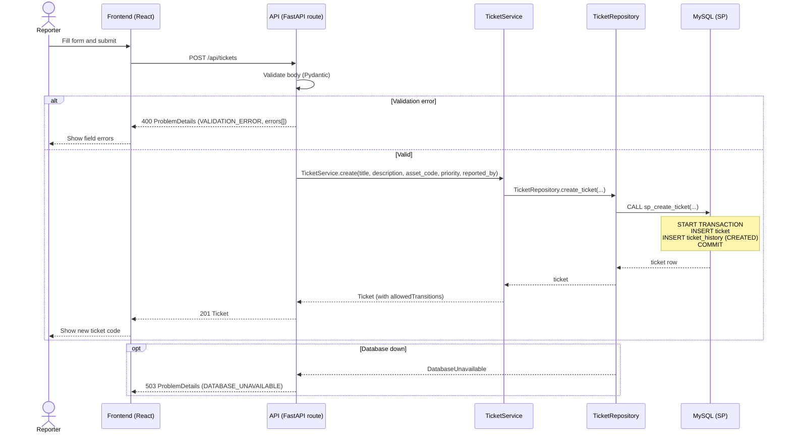
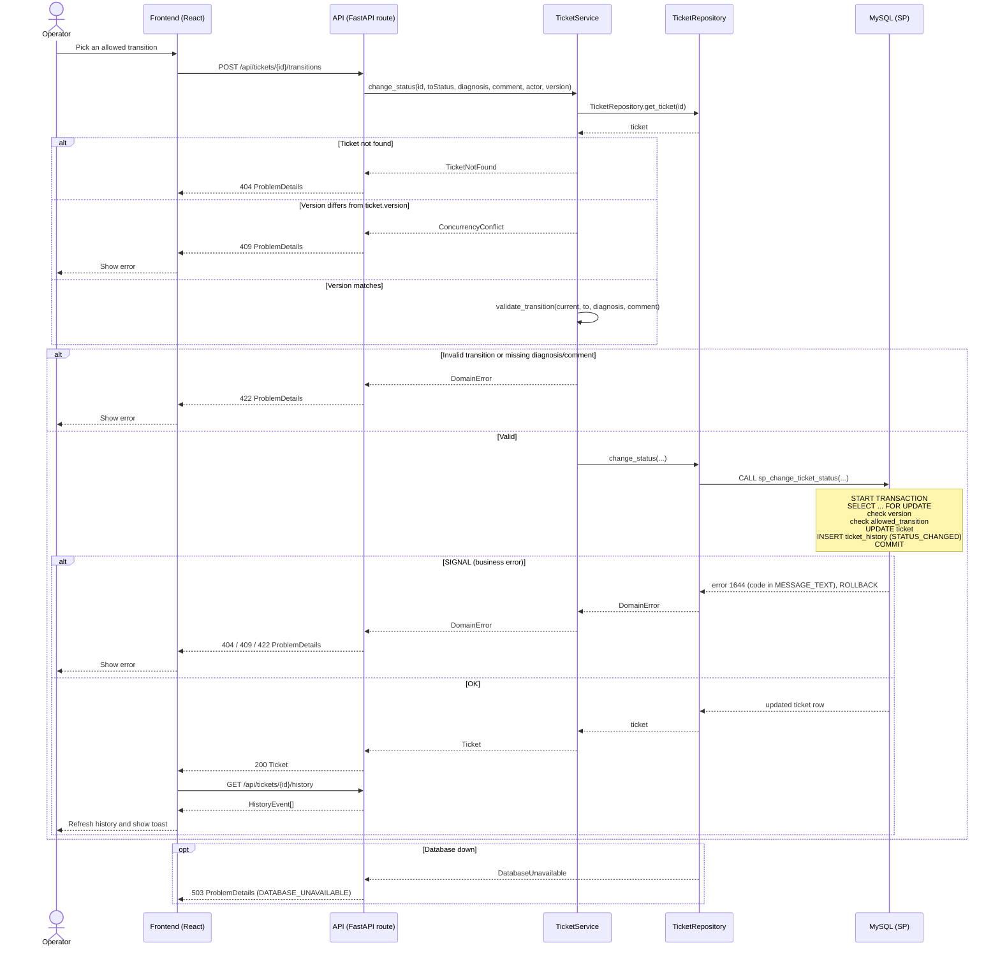

# Sequence Diagrams

## Create ticket

```mermaid
sequenceDiagram
    actor Reporter
    participant FE as Frontend (React)
    participant API as API (FastAPI route)
    participant SVC as TicketService
    participant REPO as TicketRepository
    participant DB as MySQL (SP)

    Reporter->>FE: Fill form and submit
    FE->>API: POST /api/tickets
    API->>API: Validate body (Pydantic)
    alt Validation error
        API-->>FE: 400 ProblemDetails (VALIDATION_ERROR, errors[])
        FE-->>Reporter: Show field errors
    else Valid
        API->>SVC: TicketService.create(title, description, asset_code, priority, reported_by)
        SVC->>REPO: TicketRepository.create_ticket(...)
        REPO->>DB: CALL sp_create_ticket(...)
        Note over DB: START TRANSACTION<br/>INSERT ticket<br/>INSERT ticket_history (CREATED)<br/>COMMIT
        DB-->>REPO: ticket row
        REPO-->>SVC: ticket
        SVC-->>API: Ticket (with allowedTransitions)
        API-->>FE: 201 Ticket
        FE-->>Reporter: Show new ticket code
    end
    opt Database down
        REPO-->>API: DatabaseUnavailable
        API-->>FE: 503 ProblemDetails (DATABASE_UNAVAILABLE)
    end
```

## Change status

```mermaid
sequenceDiagram
    actor Operator
    participant FE as Frontend (React)
    participant API as API (FastAPI route)
    participant SVC as TicketService
    participant REPO as TicketRepository
    participant DB as MySQL (SP)

    Operator->>FE: Pick an allowed transition
    FE->>API: POST /api/tickets/{id}/transitions
    API->>SVC: change_status(id, toStatus, diagnosis, comment, actor, version)
    SVC->>REPO: TicketRepository.get_ticket(id)
    REPO-->>SVC: ticket
    alt Ticket not found
        SVC-->>API: TicketNotFound
        API-->>FE: 404 ProblemDetails
    else Version differs from ticket.version
        SVC-->>API: ConcurrencyConflict
        API-->>FE: 409 ProblemDetails
        FE-->>Operator: Show error
    else Version matches
        SVC->>SVC: validate_transition(current, to, diagnosis, comment)
    end
    alt Invalid transition or missing diagnosis/comment
        SVC-->>API: DomainError
        API-->>FE: 422 ProblemDetails
        FE-->>Operator: Show error
    else Valid
        SVC->>REPO: change_status(...)
        REPO->>DB: CALL sp_change_ticket_status(...)
        Note over DB: START TRANSACTION<br/>SELECT ... FOR UPDATE<br/>check version<br/>check allowed_transition<br/>UPDATE ticket<br/>INSERT ticket_history (STATUS_CHANGED)<br/>COMMIT
        alt SIGNAL (business error)
            DB-->>REPO: error 1644 (code in MESSAGE_TEXT), ROLLBACK
            REPO-->>SVC: DomainError
            SVC-->>API: DomainError
            API-->>FE: 404 / 409 / 422 ProblemDetails
            FE-->>Operator: Show error
        else OK
            DB-->>REPO: updated ticket row
            REPO-->>SVC: ticket
            SVC-->>API: Ticket
            API-->>FE: 200 Ticket
            FE->>API: GET /api/tickets/{id}/history
            API-->>FE: HistoryEvent[]
            FE-->>Operator: Refresh history and show toast
        end
    end
    opt Database down
        REPO-->>API: DatabaseUnavailable
        API-->>FE: 503 ProblemDetails (DATABASE_UNAVAILABLE)
    end
```
